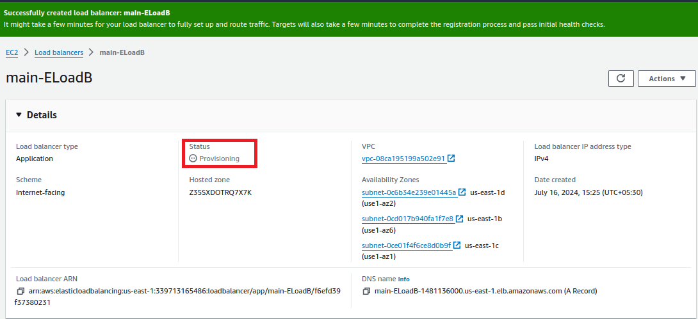

# Elastic-Application-Load-Balancer-on-AWS
Simple AWS Elastic Load Balancer project. How a ELB handle the different types of user request and allocate to EC2 machine..  

1. Here, I created a 3 Ec2 machine with Amazon Linux for ELB process. Every Ec2 machine has different subnet....
   To run this application,our security group should be enable http (port 80).
   
       #! /bin/bash
       yum install -y
       yum install -y httpd
       systemctl start httpd
       systemctl enable htppd
       echo "<h2>Welcome to the sample Elb application $(hostname -f)</h2>" >
       var/www/index.html
2. Create a application load balancer....

    

3. Be sure, 3 Ec2 machine should have different subnet.

   

4. In the network mapping session, attach your VPC and subnet details.

   

5. Attach a security group with enabled http port....

   

6. Here,We have to assign and create target group which information about out ec2 machine...

   

7. Attache your 3 Ec2 machine ,do not forget to click " Include as pending below " evenby mistake.

   
   

8. After create a target group then, attach at the listeners and routing option correctly.

   
   

9. The result of successfully create a Application ELB.It take some time to active...

    
   

10. Now ,using ELB DNS address try to access on browser.....

    

    We can access our  3 type ec2 machine.......ELB distribute the user request to different machine.....

11. Finally delete a ELB ,target group and ec2 machine properly. Otherwise they will put a charge for your usage.

                                     Thank you........................
   

    

